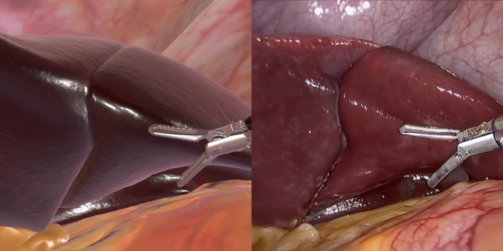

# SimuScope: Realistic Endoscopic Synthetic Dataset Generation through Surgical Simulation and Diffusion Models

[](https://arxiv.org/abs/2412.02332)

This is the official repository for SIMUSCOPE which has been accepted to IEEE/CVF Winter Conference on Applications of Computer Vision (WACV) 2025, Tucson, AZ, USA. The dataset used in this project is publicly available on Zenodo. You can access and download it using the following link: https://zenodo.org/records/14205530



The workflow is divided into two steps:<br>
1.Training<br>
2.Inference

## Training
The training was performed using https://github.com/bmaltais/kohya_ss.

To perform the training, follow the instructions provided at https://github.com/bmaltais/kohya_ss. In kohya_ss_CholectL45 and kohya_ss_CholectG_45, the necessary subfolders such as config, img, log, and model are already included. The img folder has already been generated. This setup is designed to be implemented in the kohya GUI.

Additionally, it is possible to skip using the kohya_ss GUI and directly upload an already generated command

Pretrained model it avaiable here to downoald: https://huggingface.co/stable-diffusion-v1-5/stable-diffusion-v1-5/blob/main/v1-5-pruned.safetensors

### Training data
Training Lora CholectG45:

```powershell
accelerate launch --num_cpu_threads_per_process=8 "/.../kohya_ss/sd-scripts/train_network.py" --network_train_unet_only --bucket_no_upscale --bucket_reso_steps=64 --cache_latents --cache_latents_to_disk --enable_bucket --min_bucket_reso=256 --max_bucket_reso=2048 --gradient_checkpointing --learning_rate="0.0012" --logging_dir="/.../WACV_2025/Training/Train_CholectG45/kohya_ss_CholectG45/log" --lr_scheduler="constant_with_warmup" --lr_scheduler_num_cycles="20" --max_data_loader_n_workers="0" --max_grad_norm="1" --resolution="512,512" --max_train_steps="13920" --min_snr_gamma=5 --mixed_precision="fp16" --network_alpha="1" --network_dim=128 --network_module=networks.lora --optimizer_type="Adafactor" --output_dir="/.../WACV_2025/Training/Train_CholectG45/kohya_ss_CholectG45/model" --output_name="Whole_s87_cholect45" --pretrained_model_name_or_path="/.../Pretrained_model_name/v1-5-pruned.safetensors" --save_every_n_epochs="1" --save_model_as=safetensors --save_precision="fp16" --text_encoder_lr=0.0012 --train_batch_size="5" --train_data_dir="/.../WACV_2025/Training/Train_CholectG45/kohya_ss_CholectG45/img" --unet_lr=0.0012 --xformers
```
Training Lora CholectL45:

```powershell
accelerate launch --num_cpu_threads_per_process=8 "/.../kohya_ss/sd-scripts/train_network.py" --network_train_unet_only --bucket_no_upscale --bucket_reso_steps=64 --cache_latents --cache_latents_to_disk --enable_bucket --min_bucket_reso=256 --max_bucket_reso=2048 --gradient_checkpointing --learning_rate="0.0012" --logging_dir="/.../WACV_2025/Training/Train_CholectL45/kohya_ss_CholectL45/log" --lr_scheduler="constant_with_warmup" --lr_scheduler_num_cycles="20" --max_data_loader_n_workers="0" --max_grad_norm="1" --resolution="512,512" --max_train_steps="13920" --min_snr_gamma=5 --mixed_precision="fp16" --network_alpha="1" --network_dim=128 --network_module=networks.lora --optimizer_type="Adafactor" --output_dir="/.../WACV_2025/Training/Train_CholectL45/kohya_ss_CholectL45/model" --output_name="Whole_s87_cholect45" --pretrained_model_name_or_path="/.../v1-5-pruned.safetensors" --save_every_n_epochs="1" --save_model_as=safetensors --save_precision="fp16" --text_encoder_lr=0.0012 --train_batch_size="5" --train_data_dir="/.../WACV_2025/Training/Train_CholectL45/kohya_ss_CholectL45/img" --unet_lr=0.0012 --xformers
```

## Inference

We use webui for inference.To run inference we first have to run WebUI + ControlNet++ extension
https://github.com/AUTOMATIC1111/stable-diffusion-webui

To use WebUI API:
https://github.com/AUTOMATIC1111/stable-diffusion-webui/wiki/API

We use following ControlNet checkpoint:
- Reference ControlNet - We can use this after installing it in the WebUI:
https://github.com/Mikubill/sd-webui-controlnet

To use ControlNet++ we have to download from:
-SoftEdge and Depth
https://huggingface.co/huchenlei/ControlNet_plus_plus_collection_fp16/tree/main

To run inference use ```api_inference.ipynb```

# Citation 
This work was presented at the IEEE/CVF Winter Conference on Applications of Computer Vision (WACV) 2025. If you use this code, please cite our paper:
```bibtex
@misc{martyniak2024simuscope,
    title={SimuScope: Realistic Endoscopic Synthetic Dataset Generation through Surgical Simulation and Diffusion Models},
    author={Sabina Martyniak and Joanna Kaleta and Diego Dall'Alba and Michał Naskręt and Szymon Płotka and Przemysław Korzeniowski},
    year={2024},
    eprint={2412.02332},
    archivePrefix={arXiv},
    primaryClass={cs.CV}
}
```

